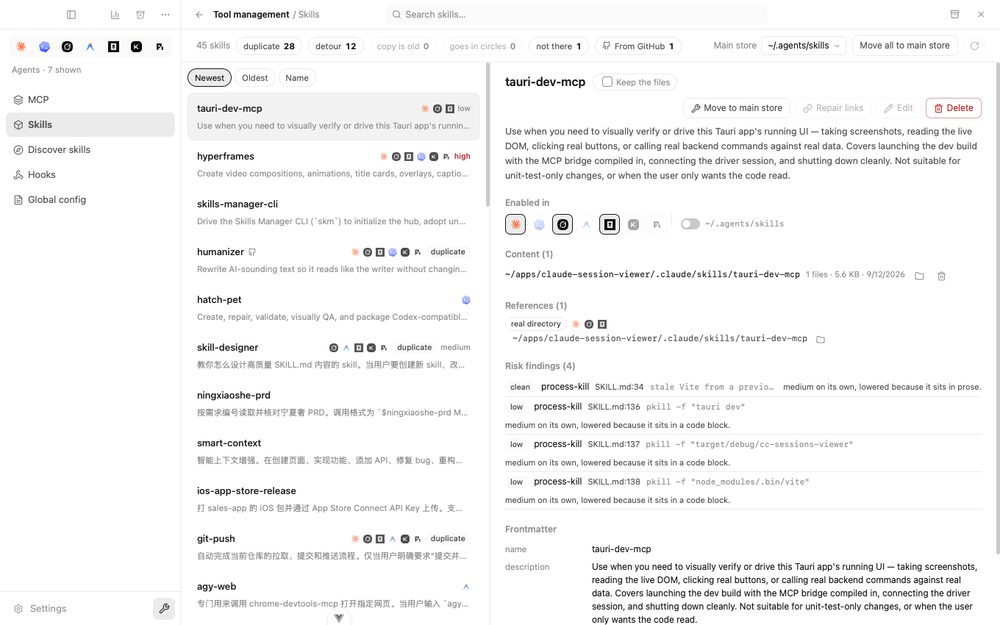
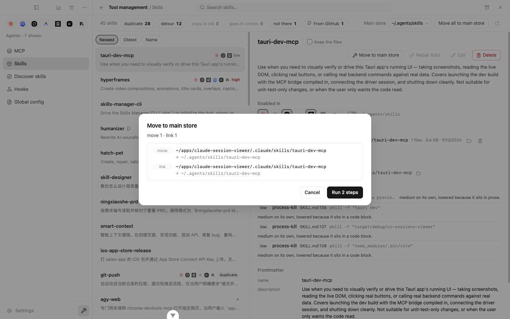
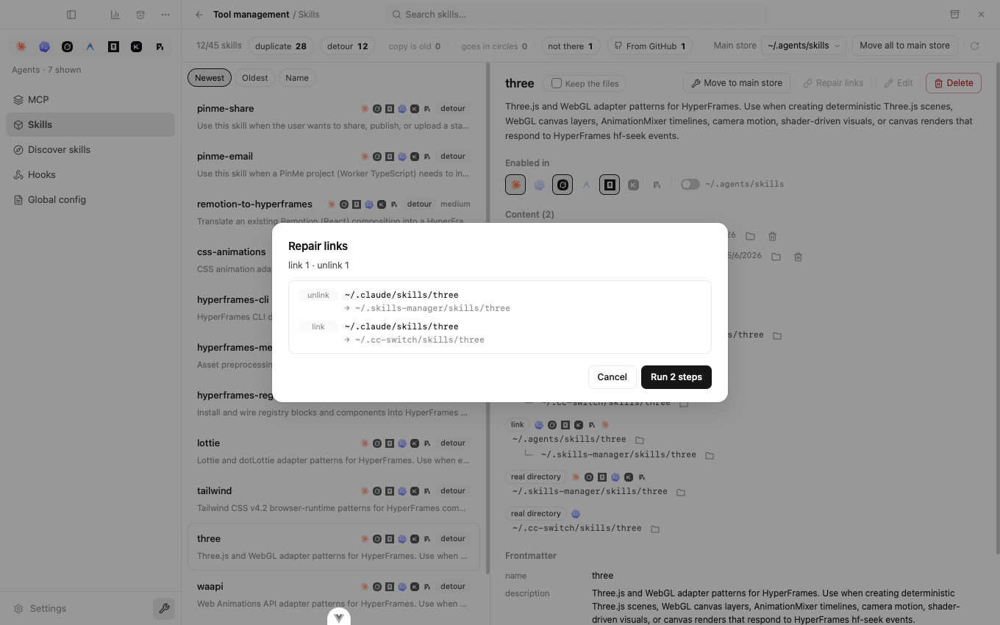
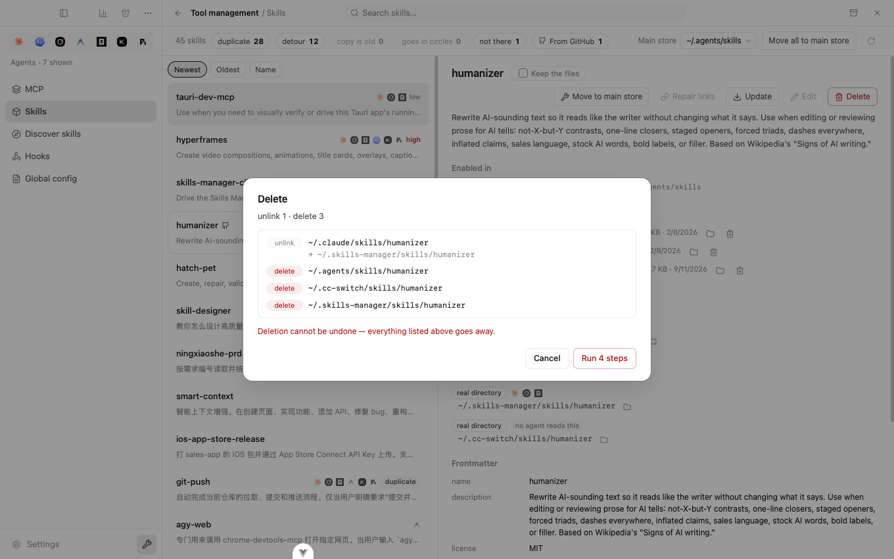
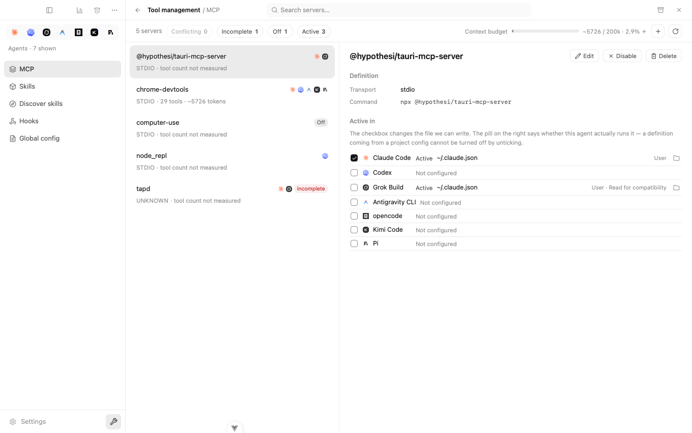
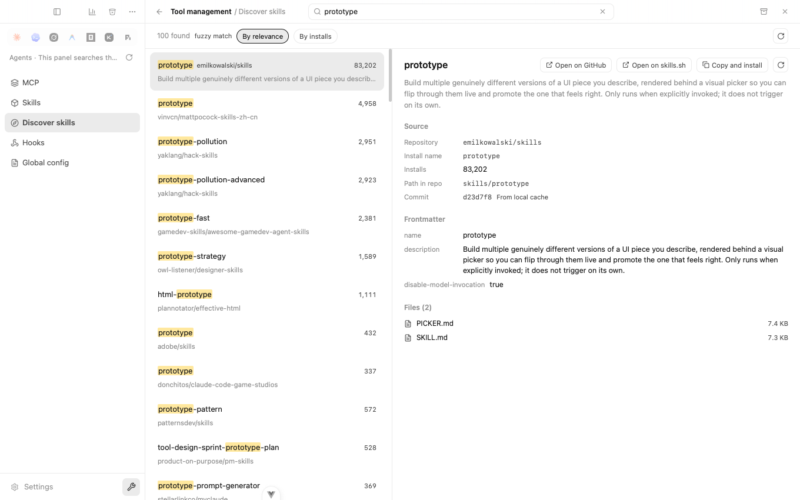
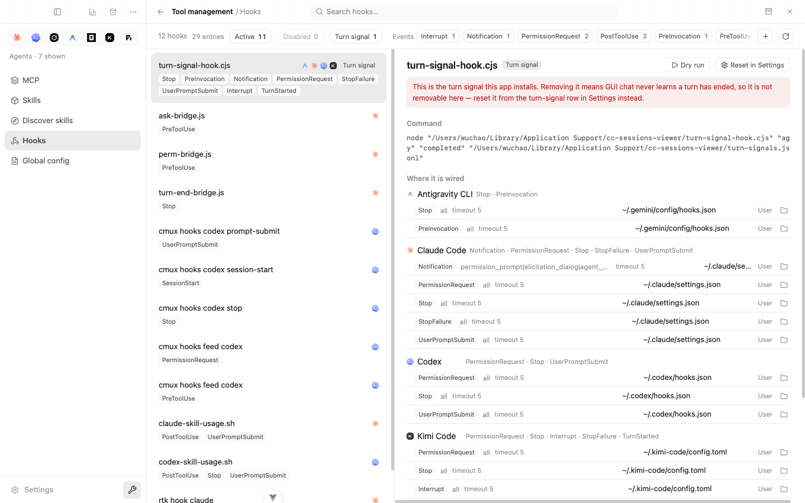
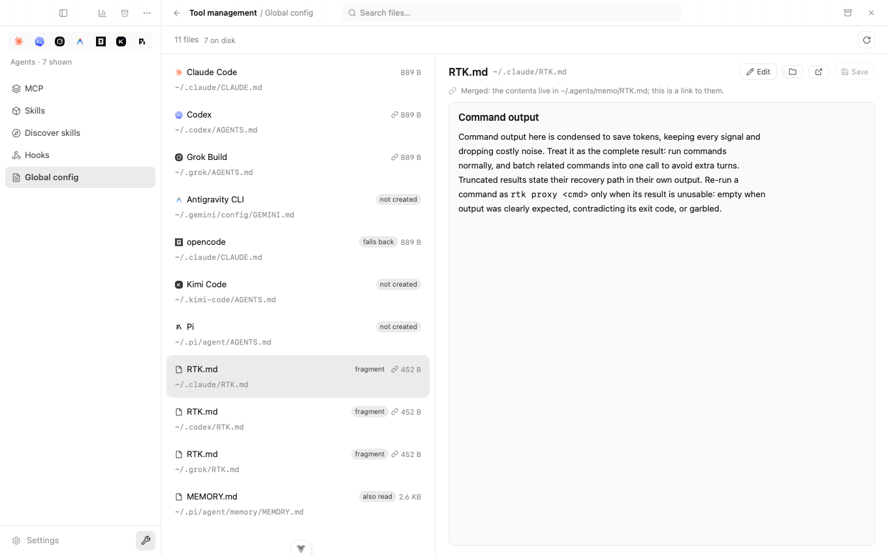

# ツール管理

[English](README.md) · [中文](README.zh-CN.md) · **日本語**

エージェント CLI はそれぞれ、skill・MCP サーバー・hook・グローバル指示ファイルをディスクのどこかに自分で持っています。ツールをいくつか入れ、数か月かけてエージェントを乗り換えていくと、いま実際に何が読み込まれているのか誰にも分からなくなります。同じ skill が 3 つのフォルダに存在し、リンクの先はとっくに削除されていて、一度だけ設定したサーバーが忘れていたエージェントで静かに動いている——そんな状態です。

このページはそれを一覧にし、その場で直せるようにします。

**開き方**：サイドバー下部のレンチアイコン、または `⌘K`。

---

## Skills

上部のバーがこのマシンの診断結果です。skill 45 個、うち **28 個が重複**、**12 個が遠回りして届いている**、**1 個は存在しない場所を指している**。どれかをクリックすると、そのカテゴリだけに絞り込めます。

skill を選ぶと、手を付ける前に知っておくべきことが右側に出ます。

- **有効なエージェント** — どのエージェントが実際に認識しているか。ここで直接オン / オフできます。
- **実体** — ファイルが実際にある場所。1 つとは限りません。
- **参照** — それを指しているすべてのリンクと、途中で何を経由しているか。
- **リスク検出** — skill から見つかったコマンド。怪しいものには印が付きます。コードブロック内に例として書かれた `rm -rf` は、実行スクリプト内の同じ行より一段低く評価されるので、バッジがちゃんと意味を持ちます。

並び替えは**新しい順 / 古い順 / 名前順**。ピン留めしたものは影響を受けません。

### メインストアへ移動

skill があちこちのフォルダに散らばっていることが、後々の面倒のほとんどの原因です。この操作はそれをメインストアにまとめ、元の場所にはリンクを残すので、動かなくなるものはありません。

実行前に手順がそのまま表示されます——ここでは `move` 1 回と `link` 1 回。ボタンを押すまで 1 バイトも書き込みません。上部の**すべてメインストアへ移動**は一括で行います。

### リンクを修復

**遠回り**とは、リンクが別のリンクを指している状態です。普段は動きますが、ある日突然動かなくなり、skill が消えた理由を突き止めるのが非常に困難になります。

修復すると、リンクは実体のあるフォルダを直接指すようになります。図では `~/.claude/skills/three` が `~/.skills-manager` を経由して `~/.cc-switch` に届いていたものが、修復後は直通になります。

### 削除

リンク切れはこうして生まれます。何かが skill のフォルダを削除し、それを指すリンクをすべて置き去りにするのです。

ここでの削除は**先にすべての参照を解除し、それからすべての実体を消します**。しかも開始前に全リストを見せます。図の skill は、調べてみると 3 つのストアに同時に存在していました。グローバル側だけ消してプロジェクト側は残したい場合は、**実体**リストから 1 つだけ削除することもできます。

---

## MCP

7 つのエージェントの MCP サーバーを、元が JSON でも TOML でも 1 つのリストにまとめます。

- **コンテキスト予算** — あなたが 1 文字も入力しないうちに、サーバーがコンテキストをどれだけ消費しているか。図の 1 台はツール 29 個・約 5,700 トークンです。
- **有効なエージェント** — どのエージェントがこのサーバーを動かしていて、それはどのファイルによるものか。**Grok Build · 互換のため読み込み**に注目してください。Grok は既定で Claude の設定を読むため、Claude に追加したサーバーが Grok でも動いています。普段はまったく見えない挙動です。
- 追加・編集・削除・有効化 / 無効化・他エージェントへの同期——いずれも変更されるファイルを先に提示します。
- トークンや鍵に見える値は、表示を求めるまでマスクされます。

---

## Skill を探す

[skills.sh](https://www.skills.sh) を検索し、インストール**する前に** skill の中身を確認できます——説明、ファイル一覧、どのコミットか、リポジトリ内のどこにあるか。

**コピーしてインストール**を押すと、その場でターミナルが開いてコマンドが入力されます。実行の様子はそのまま見えますし、`Ctrl-C` でいつでも止められます。CLI 自身の「どのエージェントに入れますか？」の問いで止まってあなたを待ちます——そこをアプリが代わりに答えることはありません。

---

## Hooks

hook はファイル単位ではなくコマンド単位でまとめられます。図の 1 行目は、1 つのスクリプトが 4 エージェント × 9 イベントに紐づいたもので、21 行ではなく 1 行として表示されています。

- 実際のペイロードで hook を**試し実行**し、出力・終了コード・所要時間をその場で確認。
- hook 全体を削除することも、紐づいている 1 か所だけを外すこともできます。
- このアプリ自身が入れた hook は印が付き、誤って削除されないよう保護されます。

---

## グローバル設定

`CLAUDE.md`、`AGENTS.md`、そしてそれらが読み込むすべて。

- **フォールバック** — opencode は自前のファイルを持たないため、Claude のものを読みます。そのファイルを編集すると両方に効きます。
- **未作成** — このエージェントは対応していますが、まだ作っていない状態。
- **フラグメント** — 他のファイルから `@import` で読み込まれているファイル。
- **追加で読まれる** — 規定のパスの外にあるのに、あるエージェントが読み込んでいるファイル。

同名なのに内容がずれてしまったファイルは印が付き、左右に並べて差分を見たり、片方を正として同期したりできます。

---

## 設定バンドル

上部バーのアーカイブアイコンから、設定一式を共有可能なファイルとして書き出せます。**値は一切含まれません**——相手に渡るのは設定の形であって、あなたの API キーではありません。取り込み時は、どの項目をどのエージェントに入れるかを自分で選びます。

---

## 常に守られる 2 つのこと

**確認するまで書き込みません。** すべての操作は、変更されるファイルを先に提示し、いつでもキャンセルできます。

**既存の内容には触りません。** このアプリが管理するキーだけを書き換え、元のファイルはバックアップとして隣に残します。読み込んだ後にファイルが外部から変更されていた場合、上書きせず書き込み自体を拒否します。
